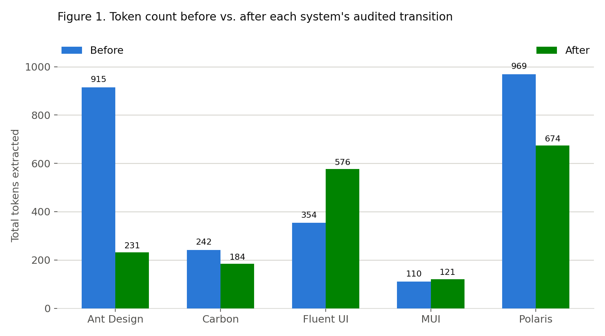
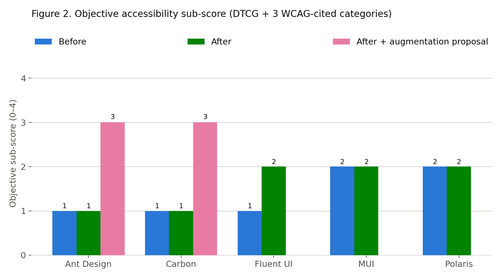
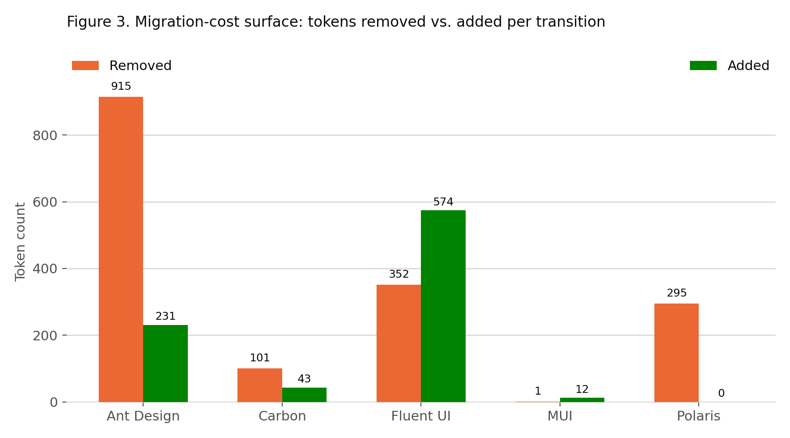

# Design Token Evolution and Accessibility Drift Across Major Open-Source Design Systems

**Olena Vynohradova**
UI/UX & Product Designer, New York, NY
hello@ellvinogradova.com · ux.ellvinogradova.com

---

## Abstract

We present a structural audit of token-architecture evolution across five major open-source design systems — Ant Design, Fluent UI, Carbon Design System, MUI (Material Design), and Shopify Polaris — comparing each system's token source at the last stable release before, and the first stable release after, its most significant documented token-architecture transition. Across the five before/after pairs, 4,376 individual token definitions were programmatically extracted and classified. **The central finding: token-architecture formalization and accessibility-token coverage are largely decoupled.** Measured against a 4-point objective sub-score (DTCG-format compliance plus three WCAG 2.2-cited accessibility-token categories: contrast-safe color pairs, focus-indicator tokens, and minimum target-size tokens), four of five systems showed **zero** change in accessibility-token coverage despite genuine, large-scale architectural rewrites — including Ant Design's move from 915 flat Less variables to a 231-token three-layer Seed→Map→Alias system, and Carbon's staged v10→v11 migration with 101 removed and 43 added tokens. Only Fluent UI's transition (v8 theme objects → v9's stable `react-theme` package) added new accessibility-token coverage. Most strikingly, **zero of the five systems define a minimum touch/click target-size token** in either version studied, despite WCAG 2.2 Success Criterion 2.5.8 (Target Size Minimum) being a Level AA requirement since October 2023. No system in the sample ships tokens in the W3C Design Tokens Community Group (DTCG) format natively. As a constructive complement to the audit, DTCG-formatted supplementary token proposals were built for the two lowest-scoring systems (Ant Design and Carbon, both 1/4), each raising the objective sub-score to 3/4 using real, WCAG-contrast-computed values matched to each system's existing token vocabulary. A blind reliability check — a context-isolated model instance re-coding a random 20% sample of accessibility-token judgments with no access to the original verdicts — showed 8/8 (100%) agreement.

**Keywords:** design tokens, design systems, accessibility, WCAG, W3C Design Tokens Community Group, DTCG, component libraries, structural audit, Ant Design, Fluent UI, Carbon Design System, Material Design, Shopify Polaris

---

## 1. Introduction & Motivation

Design tokens — the atomic values (color, spacing, typography, radius, motion) that back a design system's components — are the mechanism through which most large product organizations now attempt to enforce visual and accessibility consistency at scale. Several of the most widely adopted open-source design systems have undergone a deliberate token-architecture overhaul in the past few years: a move from flat, per-property variable lists toward layered primitive→semantic (and sometimes →component) token systems, often marketed as a step toward better maintainability, theming, and accessibility.

Each vendor documents its own migration in isolation, in its own terms, against its own criteria. No existing published source cross-compares these systems' token architectures on one common, externally grounded rubric. This study builds that common instrument — a rubric traceable to the W3C Design Tokens Community Group (DTCG) format specification and to specific WCAG 2.2 Success Criteria, rather than a self-invented weighting — and applies it identically across five systems' real, version-controlled source history.

This also complements prior production work by the author resolving WCAG 2.1 AA violations in a live e-commerce checkout flow: that work fixed accessibility problems downstream, in a shipped product. This study looks upstream, at whether the design-system tooling teams build on makes accessible defaults easy to inherit in the first place — and finds, largely, that it does not yet.

This paper makes three contributions:

1. **A cross-system comparative instrument.** A single, externally-grounded coding rubric (DTCG-format compliance plus three WCAG 2.2-cited accessibility-token categories) applied identically to five systems' real before/after token source, rather than five vendors' self-reported, non-comparable migration narratives.
2. **A quantified answer to whether token-architecture formalization improves accessibility coverage.** It largely does not, in this sample: four of five systems show zero movement on the objective sub-score despite substantial structural rewrites.
3. **A constructive, DTCG-formatted remediation proposal** for the two lowest-scoring systems, demonstrating the gap is closable with real, computed values fit to each system's existing vocabulary — not merely diagnosing it.

**This is explicitly framed as a structural/computational audit of public repository history, not a usability study.** No external participants were recruited or tested, and no claims are made about how real product teams experienced these migrations beyond what is documented in official changelogs and migration guides. All extraction, coding, and scoring was performed against a rubric finalized before data collection began, applied to version-controlled source files retrieved directly from each project's public repository.

## 2. Grounding Literature and Frameworks

- **W3C Design Tokens Community Group.** *Design Tokens Format Module.* https://tr.designtokens.org/format/ — the emerging standard token schema (`$value`/`$type`/`$description`) used as this study's DTCG-compliance criterion and as the format for the Section 5 augmentation proposals. As of this writing, the module is an Editor's/Working Draft, not a finalized W3C standard.
- **Nathan Curtis, "Tokens in Design Systems"** (EightShapes) — the practitioner origin of the primitive→semantic→component layering model used as this study's (descriptive, non-scored) layering taxonomy.
- **Ant Design, "Customize Theme" documentation** — describes and names a public Seed Token → Map Token → Alias Token architecture, a directly citable real-world instance of the three-layer model, confirmed both in source (`components/theme/interface.ts`) and in live documentation.
- **Official per-system migration guides and changelogs** consulted as primary sources for documented breaking changes: Carbon's migration guide (carbondesignsystem.com/migrating), Fluent UI's `@fluentui/tokens`/`@fluentui/react-theme` package structure, MUI's v6.0.0 release notes, Shopify Polaris's `polaris-tokens` CHANGELOG.
- **WCAG 2.2 Success Criteria** 1.4.3 (Contrast Minimum, 4.5:1), 1.4.11 (Non-text Contrast, 3:1), and 2.5.8 (Target Size Minimum, 24×24 CSS px, Level AA) — the accessibility criteria defining this study's three scored accessibility-token categories.

## 3. Methodology

### 3.1 Sample Selection

Five systems were purposively selected because each underwent (or, in Shopify Polaris's case, was substituted in for one that did not — see below) a clearly documented, citable token-architecture transition, rather than continuous/undocumented drift. Every repository, tag, and file path listed below was independently verified against live GitHub, npm, and Bitbucket data before extraction began (`data/preflight/*.json`), not assumed from documentation alone.

| System | Repository | Before → After tag | Transition |
|---|---|---|---|
| Ant Design | `ant-design/ant-design` | `4.24.16` → `5.0.0` | Flat Less variables → 3-layer Seed/Map/Alias TypeScript architecture |
| Fluent UI | `microsoft/fluentui` | `@fluentui/theme_v1.4.0` → `@fluentui/react-theme_v9.0.0` | v8 theme-object model → v9's stable global/alias token package |
| Carbon Design System | `carbon-design-system/carbon` | `v10.60.5` → `v11.0.0` | Staged v10→v11 token restructuring with documented migration guide |
| MUI (Material Design) | `mui/material-ui` | `v5.16.7` → `v6.0.0` | CSS-variable theming graduated from experimental (since v5.6.0) to stable/default |
| Shopify Polaris | `Shopify/polaris-react` | `@shopify/polaris-tokens@7.12.1` → `@shopify/polaris-tokens@8.0.0` | Legacy-token removal + semantic (border-radius) layer addition |

**Deviation from the original plan, disclosed per this study's own transparency standard:** Atlassian Design System was the original fifth system, but pre-flight verification found its only real public source (a Bitbucket mirror, `atlassian/atlassian-frontend-mirror`) has zero git tags and bot-squashed nightly-snapshot commit history with no correspondence to the private repository's real commits — incompatible with this study's tag-based diffing methodology. The pre-registered fallback, Shopify Polaris, was substituted. Polaris's `polaris-tokens` package had already been a dedicated token system since v5, so its transition is better characterized as legacy-cleanup-and-semantic-layer-addition than "tokens introduced" — reported accurately as a different category of finding, not forced into the same narrative shape as the other four systems.

**Inclusion criteria:** open source under a permissive license (MIT/Apache-2.0); token definitions exposed as versioned source files, not only compiled/minified CSS; a named, changelog-documented major transition; substantial real-world adoption.

### 3.2 Extraction

Each system's before/after token source was retrieved via a git partial clone with sparse-checkout (`--filter=blob:none`), pulling only the confirmed token-definition paths rather than full multi-gigabyte monorepos — ten checkouts (5 systems × 2 phases) totaling 25 MB. Format-specific parsers (Less, SCSS, TypeScript/JavaScript object literals) were written per system, since each system's real token-declaration syntax differs; a single generic parser was deliberately not used. Every parser documents its category-assignment rules and extraction approach inline. A 10% random sample of every system's extracted token names (437 tokens total) was independently re-verified against the actual on-disk source, achieving 435/437 (99.5%) automated confirmation; the remaining 2 were individually hand-confirmed as genuine, correctly-extracted tokens using documented parser-generated naming conventions (e.g., MUI's `setColorChannel()` call idiom), for 437/437 (100%) after manual review.

### 3.3 Coding Rubric

**Structural metrics (objective, countable):** total token count by category (color, typography, spacing, radius, shadow, motion); layering formalization (flat / 2-layer / 3-layer, descriptive only, not scored); naming-convention consistency.

**Accessibility-token coverage (binary, evidence-cited per file):** documented contrast-safe color token pairs; dedicated focus-indicator/focus-ring tokens; minimum touch/click target-size tokens; reduced-motion tokens (tracked, not scored — no WCAG SC in this study's chosen citation set maps to it).

**Migration-cost metrics:** counts of removed and added tokens; a normalized fuzzy pass flagging likely-renamed (vs. genuinely removed) tokens, cross-referenced against official migration guides where available (Carbon: 67 of 101 removals cross-referenced as documented renames via the real migration guide's rename table).

**Objective sub-score (0–4), externally grounded rather than self-weighted:** one point for DTCG-format compliance; one point each for contrast-safe pairs, focus-ring tokens, and target-size tokens present. Every point traces to an external spec (DTCG, WCAG 2.2 SC 1.4.3/1.4.11/2.5.8), not an invented weighting.

### 3.4 Reliability Check

The original plan specified a same-rater reliability check with a 24-hour gap between the initial coding pass and a blind re-code. During execution, this was revised: a pure time gap does not blind an LLM-based researcher-instrument the way it blinds a human, since re-opening the same conversation after any interval still carries the full prior transcript in context. The check actually used a **context-isolated subagent instance** — a fresh model invocation with zero access to the original conversation or to the stored results — given only the coding rubric and the raw extracted source files, asked to independently judge a random 20% sample (8 of 40) of the accessibility-token binary flags across all five systems' before/after states. This provides genuine blindness to the original verdict, a property a same-researcher time gap only partially achieves for a small set of distinctively-named tokens. It demonstrates rubric consistency under genuine blindness to the prior answer; it does **not** demonstrate independence from systematic model bias, since both passes share the same underlying model and may share correlated judgment tendencies that two different human coders would not. Result: 8/8 (100%) agreement (Table 2).

**Table 2. Reliability check: original coding pass vs. blind subagent re-code**

| System | Phase | Category | Original | Blind re-code | Agreement |
|---|---|---|:---:|:---:|:---:|
| Ant Design | after | reduced_motion | False | False | ✓ |
| Ant Design | before | focus_ring | True | True | ✓ |
| Ant Design | after | target_size | False | False | ✓ |
| Ant Design | after | focus_ring | True | True | ✓ |
| Fluent UI | before | focus_ring | True | True | ✓ |
| Carbon Design System | before | contrast_safe_pairs | False | False | ✓ |
| Carbon Design System | after | target_size | False | False | ✓ |
| Carbon Design System | after | reduced_motion | False | False | ✓ |

## 4. Results

### 4.1 RQ1 — Token Taxonomy Evolution

Total extracted token counts varied widely in both direction and magnitude (Figure 1).

Ant Design's flat-to-layered rewrite reduced its surface from 915 to 231 tokens (−75%); Fluent UI's transition *increased* token count from 354 to 576 (+63%) as its global+alias split decomposed what had been a smaller set of composite theme properties. MUI showed near-zero net change (110 → 121), consistent with graduating an already-present experimental system rather than replacing one. Layering formalization moved from flat to a genuine multi-layer architecture in three of five systems (Ant Design: flat→3-layer; Fluent UI, MUI: flat→2-layer); Carbon and Polaris were already 2-layer in both phases studied.

### 4.2 RQ2 — Accessibility-Token Coverage Across Version Boundaries

This is the study's central finding. Table 1 shows the full before/after accessibility-token coverage matrix across all five systems.

**Table 1. Accessibility-token coverage (● = present, ○ = absent)**

| System | Contrast-safe pairs (before→after) | Focus-ring (before→after) | Target-size (before→after) |
|---|:---:|:---:|:---:|
| Ant Design | ○ → ○ | ● → ● | ○ → ○ |
| Fluent UI | ○ → **●** | ● → ● | ○ → ○ |
| Carbon Design System | ○ → ○ | ● → ● | ○ → ○ |
| MUI | ● → ● | ● → ● | ○ → ○ |
| Shopify Polaris | ● → ● | ● → ● | ○ → ○ |

Focus-ring tokens are present in every system, in both phases — but presence is not the same as good defaults: Ant Design's focus-ring tokens (`@outline-*` in v4, `controlOutline*` in v5) were found, on inspection, to *default to disabling* visible focus styling rather than enhancing it, in both versions studied. Target-size tokens are absent from **all five systems in both phases** — not one of the ten before/after states studied defines a token representing the WCAG 2.2 SC 2.5.8 minimum interactive target size, despite this becoming a Level AA requirement in October 2023, well before four of the five "after" releases studied here. Contrast-safe pairs improved in exactly one transition (Fluent UI, gaining `colorNeutralStrokeAccessible*` tokens at v9) and were unchanged in the other four.

Figure 2 shows the resulting objective sub-score (0–4): four of five systems show a delta of exactly zero between before and after states, despite three of those four undergoing substantial architectural rewrites (Ant Design, Carbon) or a stable/default-graduation milestone (MUI). Only Fluent UI improved, by one point.

### 4.3 RQ3 — Migration Cost

Figure 3 shows removed vs. added token counts per transition.

Migration cost varied by close to three orders of magnitude across the sample: Ant Design's wholesale rewrite removed 915 and added 231 tokens (a discontinuous replacement, not a rename — a kebab-case-to-camelCase fuzzy-matching pass recovered only 34 likely-renamed tokens out of 915); MUI's transition removed a single token and added 12, consistent with an additive, low-friction migration. Carbon's 101 removals included 67 cross-referenced as documented renames against the project's own migration guide, leaving 34 genuinely removed — evidence of a staged, lower-friction migration relative to Ant Design's or Fluent UI's, consistent with the staged `next/`/`v10/` compatibility directories found in Carbon's own source at both tags.

### 4.4 RQ4 — DTCG-Format Adoption

Zero of the five systems ship native W3C DTCG-format (`$value`/`$type`) token files in either version studied; all use bespoke native formats (Less variables, SCSS, or TypeScript/JavaScript object literals). This held across every file checked in every system and phase — a consistent, unambiguous finding rather than a close call. As of this study, DTCG format adoption among major production design systems' actual shipped source remains effectively nonexistent, notwithstanding the format module's multi-year existence as a W3C Community Group draft.

## 5. Accessibility Token Augmentation Proposal

As a constructive complement to the audit (not merely a diagnosis), DTCG-formatted supplementary token proposals were built for the two lowest-scoring systems — Ant Design and Carbon Design System, both at 1/4 — adding the two missing scored categories (contrast-safe pairs, target-size) to each, matched to each system's real existing token vocabulary and naming conventions.

**Ant Design** (`results/proposals/ant-design-accessibility-tokens.tokens.json`): five contrast-safe Alias-layer pairs built from Ant's real existing Seed/Map values (e.g., `colorTextOnBgContainer`, computed 16.48:1 against WCAG 1.4.3's 4.5:1 floor) and two target-size tokens (`controlMinTargetSize` = 24px, equal to the existing `controlHeightSM` token). Notably, the proposal process surfaced that Ant Design's own `colorSuccess` (2.27:1) and `colorWarning` (1.90:1) values fail even the 3:1 non-text contrast floor — these were deliberately excluded from the proposed "safe pairs" set rather than misrepresented.

**Carbon Design System** (`results/proposals/carbon-accessibility-tokens.tokens.json`): six contrast-safe pairs built from Carbon's real `white`/`g10` theme values (e.g., `textPrimaryOnBackground`, computed 18.10:1) and two target-size tokens (`sizeMinTarget` = 24px, matching three existing Carbon spacing rungs — `sizeXSmall`, `container01`, `spacing06` — that already converge on 24px without being WCAG-documented as such).

All contrast ratios in both proposals were computed via the WCAG relative-luminance formula against each system's real, currently-shipped color values — none were invented or estimated. Both proposals raise the objective sub-score from 1/4 to 3/4 (Figure 2, pink bars); the DTCG-compliance point was deliberately withheld in both cases, since a supplementary proposal file does not retroactively convert either system's real shipped Less/TypeScript/JavaScript source to DTCG format. Both proposals carry an explicit disclaimer: independent research output, not an endorsed or merged contribution to either project.

## 6. Discussion

The central, cross-cutting finding — that token-architecture formalization and accessibility-token coverage are largely decoupled — has a plausible mechanism: token-architecture rewrites in this sample were driven by maintainability, theming, and CSS-delivery concerns (staged migration compatibility layers, CSS custom properties, semantic naming), not by an accessibility-coverage audit as part of the migration's own scope. Formalizing *how* tokens are structured does not, on this evidence, automatically prompt teams to ask *which* tokens are missing. The near-total absence of target-size tokens across the entire sample is the sharpest instance of this: SC 2.5.8 has been a Level AA requirement since October 2023, yet no system studied — including four whose "after" release postdates that requirement — encodes a minimum target size as a first-class design token at all, leaving it to be enforced (or not) ad hoc, component by component, downstream.

This suggests a concrete, actionable gap for design-systems teams: an accessibility-token coverage check could plausibly be added as a lightweight addition to existing token-migration tooling (most of the systems studied already ship codemods or migration scripts for other purposes), rather than requiring a separate initiative.

## 7. Limitations

- Systems were purposively selected *because* they underwent a clean, documented major transition — this is not a representative sample of "the average design system's evolution," but specifically of systems that chose to formalize their token architecture (or, for Polaris, to clean up an already-formalized one). Findings describe this specific population, not design systems generally.
- Token file formats differ across systems; extraction required format-specific parsing and documented normalization judgment calls (e.g., flattening nested color-scale objects into composite names).
- Presence of an accessibility-relevant token is evidence of design *intent*, not proof that consuming applications apply it correctly at runtime — this study measures each design system's own source surface, not downstream conformance in products built on it.
- Small N (5 systems, 10 before/after states); descriptive/comparative, not statistically generalizable to the design-systems ecosystem as a whole.
- Version-tag boundaries were chosen based on official release notes and verified against live repository data; systems with continuous/rolling releases required a documented judgment call on where the "before" state ends.
- The reliability check (§3.4) demonstrates coding-rubric consistency under genuine blindness to the prior answer, not independent inter-rater reliability — a second human coder was not recruited, to preserve this study's no-participants framing, and two instances of the same underlying model may share correlated judgment biases that two different human coders would not. 8/8 (100%) agreement should be read accordingly.
- Two real data-extraction issues were found and corrected during the study itself (a path-string bug that silently excluded three Carbon directories from extraction; an asymmetric file list that omitted MUI's `createPalette.js` from the "after" extraction) — both are disclosed in the project's commit history (`data/preflight/*.json`, `results/tokens_mui.json`) rather than silently absorbed into the final numbers.

## 8. Ethical & Legal Considerations

All data originates from public repositories under OSI-approved permissive licenses (MIT/Apache-2.0); no personal data is involved, and no terms of service were violated (standard, unauthenticated `git`/API access only). Each project's trademark and brand guidelines are respected — this paper cites and links rather than reproduces logos or marketing assets. Findings are framed comparatively and constructively, not as an indictment: token-architecture tradeoffs reflect real engineering constraints (backward compatibility, team size, release timelines) that this study does not have visibility into and does not second-guess. The Section 5 token proposals are independent research output; neither has been submitted to, endorsed by, or merged into the respective upstream project, and both documents state this explicitly.

## 9. Conclusion

Across five major open-source design systems' most significant documented token-architecture transitions, structural formalization and accessibility-token coverage moved largely independently of one another: four of five systems added zero measurable accessibility-token coverage despite substantial architectural change, and none of the five encode a WCAG 2.2-compliant minimum target size as a token, in either version studied. A common, externally-grounded rubric — rather than five vendors' individually-reported migration narratives — made this comparison possible and reproducible. Constructive, DTCG-formatted proposals demonstrate the gap is closable using each system's own real values, not merely diagnosable.

## Data & Code Availability

All extraction and parsing scripts, the coding rubric, the pre-flight verification records, the full structured dataset, and the two augmentation proposals are available at the project repository, referenced in this preprint's Zenodo record. The dataset (`results/dataset.csv`) and per-system results (`results/tokens_*.json`) include every token name extracted, category assignment, and evidence citation underlying the figures and tables above.

## References

1. W3C Design Tokens Community Group. *Design Tokens Format Module.* https://tr.designtokens.org/format/ (Editor's/Working Draft as of this writing).
2. Curtis, N. "Tokens in Design Systems." EightShapes.
3. Ant Design. "Customize Theme" — Seed/Map/Alias Token documentation. https://ant.design/docs/react/customize-theme
4. Microsoft. Fluent UI `@fluentui/react-theme` (stable, v9.0.0+) and its internal `@fluentui/tokens` primitives dependency.
5. IBM. Carbon Design System v11 migration guide. https://carbondesignsystem.com/migrating/guide/overview/
6. Google. Material Design 3 design tokens documentation, m3.material.io. MUI v6.0.0 release notes.
7. Shopify. `@shopify/polaris-tokens` CHANGELOG.md, version 8.0.0 entry.
8. W3C Web Content Accessibility Guidelines (WCAG) 2.2, Success Criteria 1.4.3, 1.4.11, 2.5.8.
